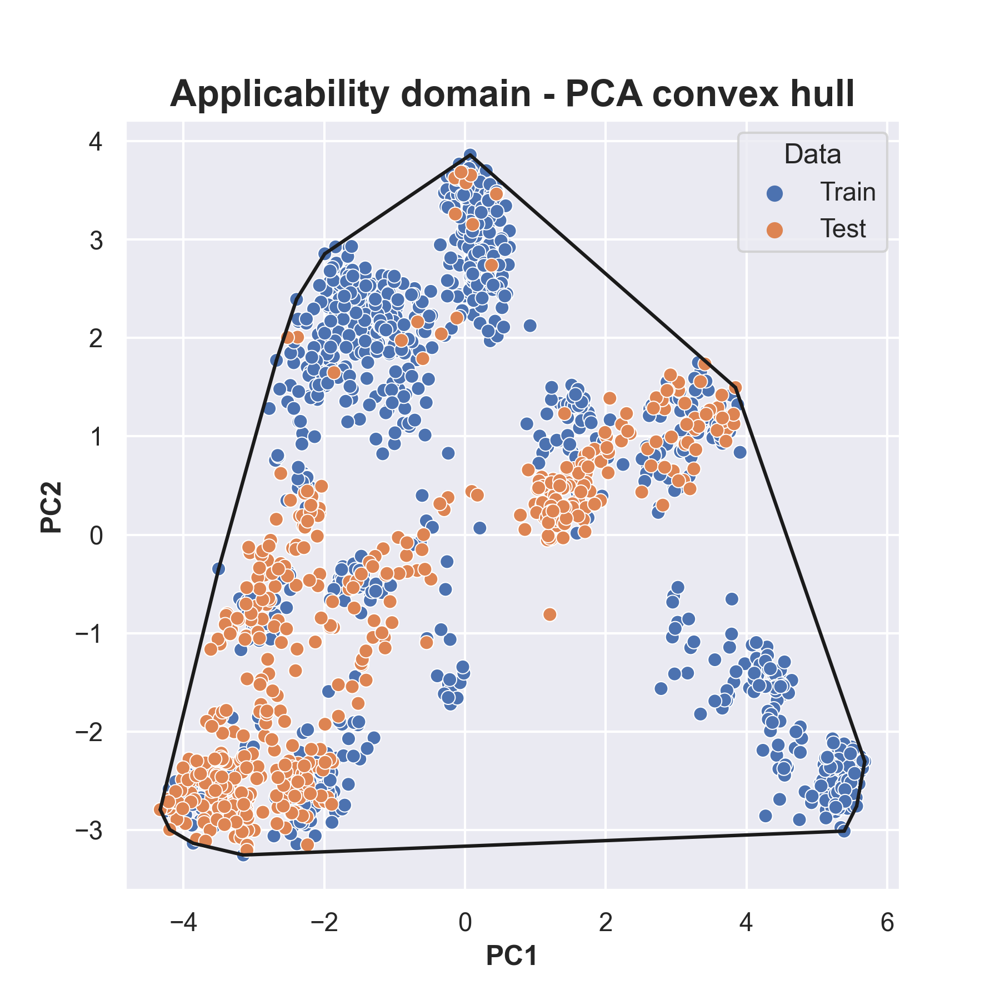

# QSAR Model Applicability Domain Determination

## Overview

This repository explores advanced methodologies for determining the applicability domain of a Quantitative Structure-Activity Relationship (QSAR) model. The approaches employed leverage sophisticated techniques such as Principal Component Analysis (PCA) and Tanimoto Similarity Matrix coupled with Multidimensional Scaling (MDS) algorithms.

## Methodologies

### Approach 1: PCA-based Dimension Reduction and Convex Hull

In the first approach, molecular fingerprints undergo precise dimension reduction through Principal Component Analysis (PCA), resulting in a streamlined 2-dimensional representation. Subsequently, these observations are meticulously visualized on a plane, and a Convex Hull algorithm is applied to precisely delineate the confidence region.

### Approach 2: Tanimoto Similarity Matrix, MDS and Convex Hull

The second approach commences by calculating a Tanimoto similarity matrix, meticulously pairing molecules from both the training dataset (m molecules) and screening dataset (n molecules). This intricate process results in a (m+n) x (m+n) matrix. Following this, dimension reduction to 2 dimensions is applied to the matrix through state-of-the-art MDS algorithms. The resulting observations are meticulously plotted on a plane, and akin to the first approach, a Convex Hull algorithm is employed for precise delineation of the confident region.

## Instructions

For comprehensive instructions and detailed code implementation, please refer to the [Applicability_domain_screen.ipynb](Applicability_domain_screen.ipynb) notebook.

## Usage Guidelines

Follow the outlined steps in the notebook to effectively apply the proposed methodologies for determining the applicability domain of your QSAR model.

## Contact

For any questions or inquiries, please contact [The-Chuong TRINH](thechuong123@gmail.com).

## Contributions

Contributions are highly encouraged. If you have valuable suggestions, improvements, or innovative ideas, please feel free to open an issue or submit a pull request.

